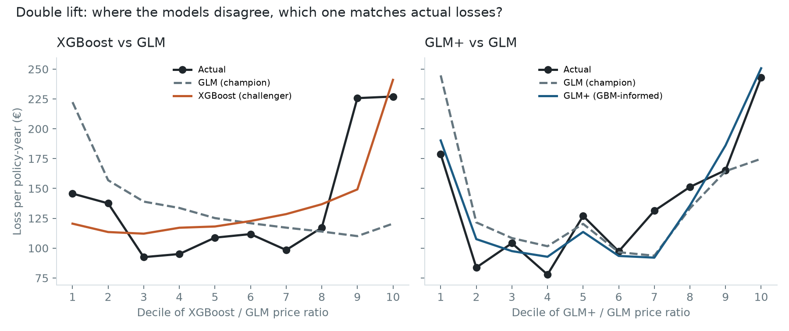
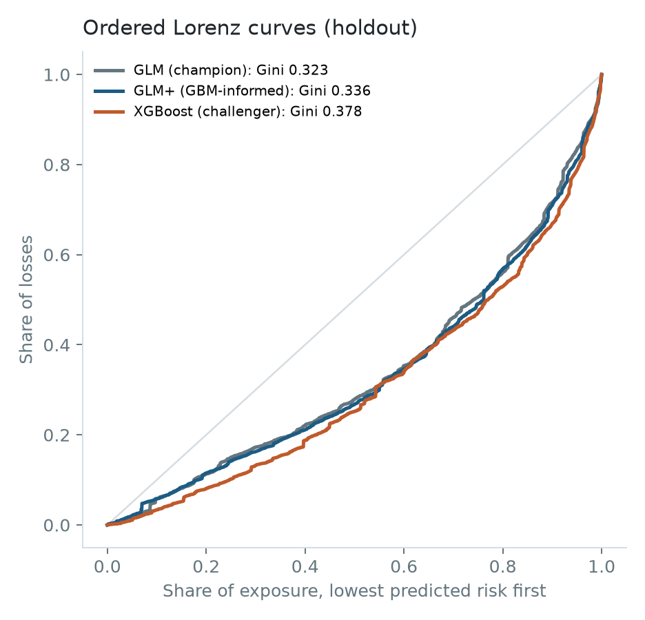
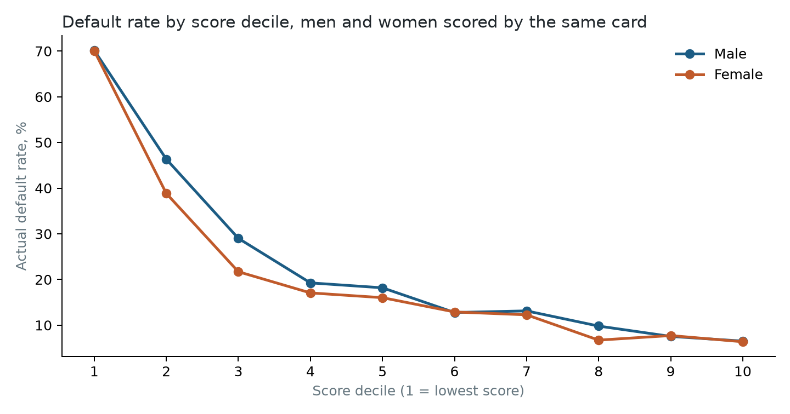

# Auto insurance pricing and credit scoring: GLM champion vs gradient-boosted challenger

Two risk models built the way a pricing or credit team would review them, not just trained:

1. **Auto claims pricing.** A Poisson frequency × Gamma severity GLM in **PySpark** on 678,013
   French motor liability policies. It is compared with an XGBoost challenger and with a
   "GBM-informed" GLM+, using the checks that decide whether a rating model gets replaced.
2. **Credit scorecard.** A weight-of-evidence logistic GLM on 30,000 credit-card accounts, with
   adverse-action reason codes and a fairness check on groups the model never sees.

## The answer

| Decision | Recommendation | Evidence |
|---|---|---|
| Replace the rating GLM with XGBoost? | **No, not directly** | XGBoost ranks risk better (Gini +0.055, 95% CI +0.018 to +0.088), but moves 74% of premiums by more than 10% and 40% by more than 25%, and its severity model is worse than the GLM's |
| Adopt GLM+ (GLM with bonus-malus bands and three filed-rate terms)? | **Yes** | Gini +0.013 (CI +0.005 to +0.023), AIC −851, better on the double-lift chart at both ends; moves 12% of premiums by more than 25% |
| Close the remaining gap? | **Keep XGBoost as the challenger and keep mining it** | It still beats GLM+ by 0.042 Gini (CI +0.010 to +0.075). Its next-strongest interaction (bonus-malus × region) is not in GLM+ yet |
| Use the credit scorecard as built? | **Yes, with a calibration monitor by group** | AUC 0.769, KS 0.42, approval ratios above 0.92 for every sex and age group, but the same score means about 1 to 2 points higher default risk for men and people 45+ than for women and people under 30 |

The one-page recommendation is in [MEMO.md](MEMO.md).

## Part 1: auto claims pricing

### Data and the three problems in it

**freMTPL2** (OpenML 41214 / 41215) holds 678,013 policies, 358,499 policy-years of exposure,
and 26,639 claim payments. It is the standard public data set for motor pricing research.

1. **Duplicate risks.** 38% of rows share every rating field with another row (up to 22 rows):
   often the same driver on several contracts. A random split would put 32% of test policies
   next to a twin in training. **The split keeps each group of identical profiles together**
   (542,202 training and 135,811 holdout policies, 105,920 holdout groups).
2. **Reported claims vs paid claims.** 9,116 policies report claims but have no payment on
   record, and each policy has either all its claims paid or none. The first version priced
   reported claims × paid severity, and **the holdout calibration check caught it: predicted
   losses were 48% too high.** Pricing now uses paid claims (26,405), so frequency and severity
   describe the same claims.
3. **Heavy tail.** The median claim is €1,172 and the largest €4.1M. Claims are capped at €200,000,
   and claim counts at 4 per year (5 to 16 are recording errors).

### Models

- **GLM (champion)**, fitted in Spark MLlib ([src/spark_glm.py](src/spark_glm.py)): Poisson frequency
  with a log link and log(exposure) offset, and Gamma severity weighted by claim count. It has 49 terms
  for vehicle power, age and brand, fuel, region, driver age, log bonus-malus and log density, with the
  most common level as the reference. **Refitting the same design in statsmodels matches Spark's
  coefficients to within 4×10⁻¹¹.**
- **XGBoost (challenger)** ([src/challenger.py](src/challenger.py)): Poisson boosting with the same
  log(exposure) offset, plus Gamma boosting for severity. Depth is tuned on held-back risk groups
  (frequency depth 7 with 297 rounds, severity depth 2 with 28 rounds).
- **GLM+ (GBM-informed)**: the challenger's strongest SHAP interaction is driver age × bonus-malus.
  The GLM's actual-to-expected on the *training* data showed where: the log-linear bonus-malus
  underprices levels 51 to 70 by 15% to 37% and overprices 81 to 90 by 24%. GLM+ replaces the slope
  with rating bands and adds three indicators an actuary can file and explain:

| Term | Relativity | Reading |
|---|---|---|
| Older driver (50+) above the bonus-malus floor (51 to 80) | ×1.43 | Not yet at the floor at that age means recent claims |
| Mature driver (30+) at the entry level (81 to 100) | ×0.73 | New to insurance, but not a young driver |
| Brand B12, vehicle in its first year | ×0.79 | Carried over from the first run's top interaction (vehicle age × brand), still significant (p < 0.001) |

GLM+ changes the frequency model only. A severity model with the same terms scored worse on the
holdout (Gamma deviance 1.309 vs 1.303), so GLM+ keeps the base severity model.

### Holdout results (grouped, 135,811 policies)

| | GLM | GLM+ | XGBoost |
|---|---|---|---|
| Frequency deviance (Poisson) | 0.2377 | 0.2364 | **0.2332** |
| Severity deviance (Gamma) | **1.3033** | 1.3033 | 1.3104 |
| Pure-premium Gini | 0.323 | 0.336 | **0.378** |
| Premiums moving >10% vs the GLM | | 45% | 74% |
| Premiums moving >25% vs the GLM | | 12% | 40% |

Gini differences come with 95% intervals from 300 bootstrap draws that **resample whole risk groups**,
so near-duplicate policies do not make the intervals look tighter than they are.



**The double-lift chart** sorts policies by how much the two models disagree. Against the GLM, GLM+
tracks actual losses at both ends: in the top decile, actual is €243 per policy-year, GLM+ says
€251 and the GLM says €175. XGBoost wins the tails too, but prices the middle deciles too high.



**Calibration.** Each model's base rate is off-balanced so predicted loss equals actual loss on the
training data. All three models predict about 9.5% more than the holdout's actual loss. That is the
same for every model, so it does not affect the comparison. It comes from the holdout itself: paid
claims ran 3.2% below expectation, and the average paid claim was €1,881 against €1,997 in training,
because fewer large claims fell in the holdout (claims over €50,000 were 17% of loss vs 19%).

**The split experiment.** A random split would have put 32% of test policies next to their twin
in training. On this data it barely changed the answer: XGBoost's deviance advantage was 1.87% on the
random split and 1.92% on the grouped one. The regularization (min_child_weight 50, row
subsampling) keeps the trees from memorizing individual drivers. The grouped split is still the right design, but here it
was not hiding a large bias.

## Part 2: credit scorecard with reason codes and a fairness check

**Data:** UCI "default of credit card clients", 30,000 Taiwan cardholders in 2005; 22.1% defaulted
the following month. Sex, age, education and marital status are **not inputs**. They are used
only afterwards to check the results.

**Build** ([src/credit.py](src/credit.py)):
1. Seven characteristics from the account's own behaviour (recent status, late months, worst
   delinquency, utilization, limit, payment ratio, balance trend).
2. Monotone weight-of-evidence binning on a 70% training sample.
3. A logistic GLM on WoE, keeping characteristics with the expected sign and p < 0.01.
4. Points scaled so 600 points = 50:1 odds, and 20 points doubles the odds.

**Two judgment calls:**
- **Balance trend was dropped.** Its information value is 0.05, but default risk is U-shaped in it
  (flat balances default at 31%, falling or growing ones at 17% to 22%). No single adverse-action
  reason can describe that to a consumer.
- **Reason codes come only from characteristics that count against the applicant.** Ranking reasons
  by "points below the best attribute" would have told a customer who paid in full that a payment
  was past due.

**Results (holdout, 9,000 accounts):**
- **Scorecard:** AUC 0.769, Gini 0.539, KS 0.42, from five characteristics.
- **Challenger:** XGBoost on all seven characteristics reaches AUC 0.787.
- **Stability:** score PSI between train and holdout is 0.001.

Example declines, with their reason codes:

| Score | Reasons (in order) |
|---|---|
| 459 | Recent payment past due; serious delinquency in the last 6 months; number of late payments; credit limit low |
| 517 | Serious delinquency in the last 6 months; number of late payments; credit limit low |

**Fairness at a 75% approval cutoff:**

| Group | Approval rate | Ratio to highest | Actual default | Predicted default |
|---|---|---|---|---|
| Women | 76.3% | 1.00 | 20.4% | 21.7% |
| Men | 71.9% | 0.94 | 24.7% | 23.5% |
| Under 30 | 71.1% | 0.92 | 22.9% | 24.2% |
| 30 to 44 | 77.3% | 1.00 | 20.4% | 20.9% |
| 45+ | 73.4% | 0.95 | 25.5% | 23.2% |



Every group's approval ratio is above 0.92, well clear of the four-fifths rule of thumb. **But the
score is not equally calibrated.** It overstates default risk for women and people under 30, and
understates it for men and people 45+. Approved men default at 13.4% against 11.8% for approved
women. Fixing this should not mean adding protected attributes as inputs. The next steps are to
find which characteristics carry the gap (credit limit is a candidate, since limits track age and
income) and to monitor calibration by group.

## Limitations

- **No time dimension.** freMTPL2 has no policy dates, so there is no out-of-time test. The grouped
  split is the strongest available substitute.
- **Paid-claim frequency assumes the 9,116 unpaid claims cost nothing.** That is the reading the
  data supports, since each policy has all claims paid or none, but it is an assumption.
- **The data sets are separate.** The claims data has no credit attributes and the credit data has
  no claims, so this does not test credit-based insurance scores directly. It shows both halves of
  the method.
- **GLM+ terms were chosen by looking at training misfits**, then judged once on the holdout. A new
  holdout would be needed to test a second round of terms.

## Reproduce

```bash
DATA_DIR=/path/with/space bash scripts/download.sh     # about 42 MB
pip install -r requirements.txt                        # Spark 4 needs Java 17 or 21 on JAVA_HOME
export DATA_DIR=/path/with/space
python src/load.py && python src/spark_glm.py && python src/challenger.py && python src/validate.py
python src/credit.py
pytest -q                                              # metric functions against hand-checked cases
```
